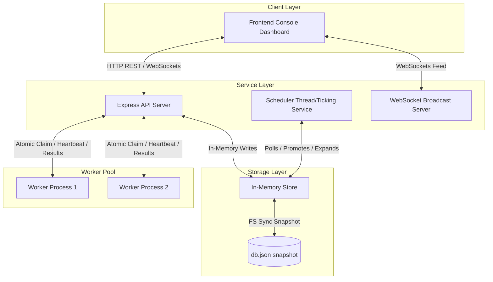
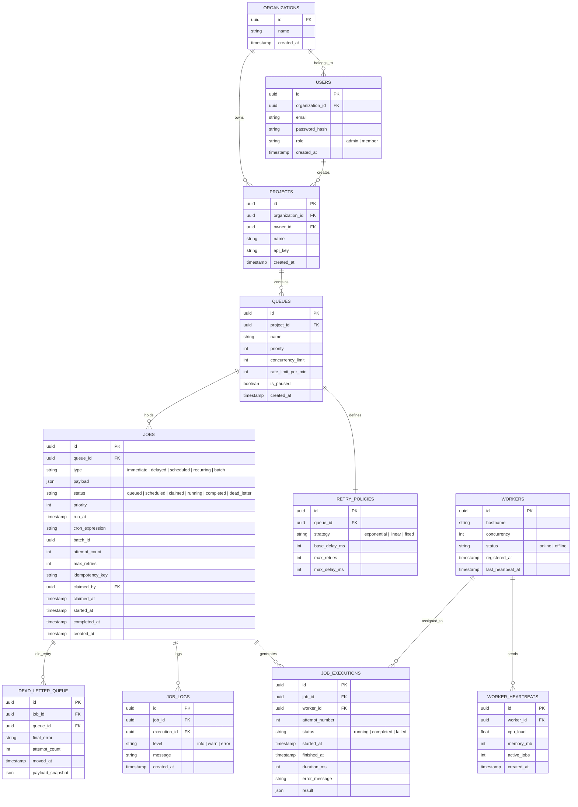

# Distributed Job Scheduler — Engineering Documentation & Architecture

This document provides a comprehensive analysis of the system architecture, database design, backend engineering patterns, reliability/concurrency mechanisms, API specifications, and testing details for the Distributed Job Scheduler.

---

## 1. System Architecture

The project is structured as a decoupled, multi-process system to mirror a production-grade distributed architecture.

### Architectural Blueprint


### Component Details
1. **API Server (`backend/src/server.js`)**: Serves as the single gateway and coordinator. It manages projects, queues, user authentication, and coordinates worker heartbeats and job statuses.
2. **Worker Pool (`backend/src/worker.js`)**: Independent Node.js processes. They register with the API server, poll periodically for available work from their designated queues, run the jobs concurrently (controlled by `WORKER_CONCURRENCY`), transmit periodic heartbeats, and capture execution results.
3. **Scheduler (`backend/src/services/scheduler.js`)**: A background clock service running in the API server. It promotes delayed/scheduled jobs whose start times have arrived and expands recurring cron jobs into individual executions.
4. **WebSocket Server (`backend/src/services/ws.js`)**: Broadcasts job creation, claims, completions, and failures to all connected dashboards in real time.
5. **Dashboard (`frontend/index.html`)**: A client application displaying system metrics, live event logs, a job explorer, queue managers, and Chart.js metrics.

---

## 2. Database Design & ER Diagram

The database is designed around a fully normalized relational structure. While the execution environment uses a memory store mirrored to a JSON file (`backend/data/db.json`), the schemas mirror SQL tables exactly (as outlined in `backend/schema.sql`).

### Entity-Relationship Diagram (ERD)


### Relational Schema Design Considerations
1. **Normalization**: The schema is designed in 3rd Normal Form (3NF). Core properties (like retry policies and executions) are extracted into distinct tables to support multi-attempt audits without duplicating static job payloads.
2. **Primary & Foreign Keys**: All tables use globally unique identifiers (UUIDs) as primary keys, avoiding clashes across horizontally scaled shards. Clear foreign key constraint bounds are mapped to enforce referential integrity.
3. **Indexes**: In a production database, the following indexes are vital:
   - `jobs(status, run_at, priority)`: Essential for scanning/claiming eligible jobs rapidly.
   - `jobs(queue_id)` & `job_executions(job_id)`: Speeds up dashboard aggregations and detail lookups.
   - `users(email)`: Enforces uniqueness and optimizes login performance.
4. **Cascading Behavior**:
   - `ON DELETE CASCADE` is set on `projects → queues`, `queues → jobs`, and `jobs → job_executions/job_logs`. If a queue is removed, its associated job trace is safely cleaned up.
   - `ON DELETE RESTRICT` is set on `users → projects` to prevent accidental deletion of project hierarchies when offboarding team members.

---

## 3. Backend Engineering

The backend is built with Node.js and Express. It enforces clean separation of concerns:

- **Routes Layer (`backend/src/routes/`)**: Handlers validating request structures and mapping REST endpoints to service boundaries.
- **Service Layer (`backend/src/services/`)**: Houses business logic (retry calculation, batch expansions, scheduler sweeps, claims processing, and WebSocket broadcasts).
- **Store Layer (`backend/src/db/store.js`)**: Encapsulates persistence. It can be swapped for Knex or Prisma without touching business logic.

### Modularity & Middleware
1. **JWT Authentication**: The [auth.js middleware](file:///d:/Project/job-scheduler/backend/src/middleware/auth.js) intercepts incoming requests, validates bearer tokens, and embeds user metadata.
2. **Role-Based Access Control (RBAC)**: Supports roles (`admin`, `member`). The `requireRole('admin')` middleware blocks modifying endpoints for members.
3. **API Rate Limiting**: Implements global rate limits (300 requests/min per IP) to prevent DDoS attacks on the REST interface, alongside a stricter limit on authentication endpoints.
4. **Queue Rate Limiting**: Protects downstream microservices by rejecting job submissions with `429 Too Many Requests` when a queue's rolling rate limit is breached.

---

## 4. Reliability & Concurrency

### Concurrency & Horizontal Scaling
To scale to multiple worker processes without double-processing jobs, claiming must be **atomic**.

* **Postgres Target Design**:
  ```sql
  UPDATE jobs SET status = 'claimed', claimed_by = $1, claimed_at = NOW()
  WHERE id = (
      SELECT id FROM jobs 
      WHERE status = 'queued' AND queue_id = ANY($2)
      ORDER BY priority DESC, created_at ASC 
      LIMIT 1 
      FOR UPDATE SKIP LOCKED
  ) RETURNING *;
  ```
  `FOR UPDATE SKIP LOCKED` locks the matched row so concurrent transactions ignore it, preventing race conditions.
* **In-Memory Store Implementation**: Because Node.js is single-threaded, synchronous functions run to completion before yielding to the event loop. The claim check (`claimNextJob`) runs synchronously, guaranteeing that only one claim operation processes at any microsecond, ensuring atomicity.

### Reliability Mechanisms
1. **Idempotency**: Job creation supports an optional `idempotency_key`. Repeating a creation request returns the existing job record, protecting against network retries.
2. **Graceful Shutdown**: The worker listens for `SIGTERM` / `SIGINT` signals. Upon intercept, it halts polling, sends a `drain` notice to the server, allows in-flight jobs to complete (up to 30s), and shuts down cleanly.
3. **Worker Heartbeats**: Workers transmit heartbeats every 5 seconds. If a worker goes silent, its status changes to offline, and its active jobs are rescheduled.
4. **Dead Letter Queue (DLQ)**: Once a job exhausts its `max_retries`, it transitions to `dead_letter` status and a snapshot is written to the DLQ table, isolating the failed job for audit and manual re-queueing.

---

## 5. Frontend & UX

The dashboard console [frontend/index.html](file:///d:/Project/job-scheduler/frontend/index.html) is built with vanilla Javascript.

- **Theme & Aesthetics**: Utilizes a dark-mode palette (`#07090E`), translucent glassmorphism borders (`backdrop-filter: blur()`), and glowing status states.
- **Charts & Data Visualizations (Chart.js)**:
  - **Throughput trends**: Real-time line chart mapping job completions over time.
  - **Job Distribution**: Doughnut chart illustrating status ratios.
- **Observability**: Clicking a job row opens an inspection modal displaying the JSON payload, execution logs, and historical attempts.
- **AI Diagnostics**: Employs a diagnostic analyzer that outputs structured recommendations for troubleshooting failures.

---

## 6. API Design Specification

### Authentication & Registration
* `POST /api/auth/register`: Create organization and user. Returns JWT token.
* `POST /api/auth/login`: Authenticate credentials. Returns JWT token.

### Projects & Queues
* `GET /api/projects`: List projects owned by the user's organization.
* `POST /api/projects`: Create a project.
* `GET /api/projects/:projectId/queues`: List queues under a project (includes live metrics).
* `POST /api/projects/:projectId/queues`: Create a queue.
* `PATCH /api/queues/:id`: Update queue priority, concurrency, rate limits, or retry policy.
* `POST /api/queues/:id/pause`: Pause a queue.
* `POST /api/queues/:id/resume`: Resume a queue.

### Job Operations
* `POST /api/queues/:id/jobs`: Create a job (supports `immediate`, `delayed`, `scheduled`, `recurring`, and `batch` formats).
* `GET /api/queues/:id/jobs`: Query and filter jobs (supports status, type, and pagination query params).
* `GET /api/jobs/:jobId`: Fetch full job details, execution history, console logs, and AI diagnostics.

### Workers
* `POST /api/workers/register`: Register a worker node.
* `POST /api/workers/:id/claim`: Atomically claim a job matching a list of queues.
* `POST /api/workers/:id/heartbeat`: Send worker health metrics (CPU, Memory, current job load).
* `POST /api/workers/:id/drain`: Mark a worker as draining during shutdown.

---

## 7. Testing

Automated unit tests check the system's core business logic, such as backoff calculations and concurrency controls.

### Running the Tests
To execute the automated test suite, navigate to the backend directory and run:
```powershell
npm test
```

### Coverage Scope
The test suite validates:
1. **Backoff Delay Calculations**: Verifies fixed, linear, and exponential strategies, ensuring delays scale correctly and respect `max_delay_ms` limits.
2. **Atomic Claim Mechanics**: Creates queues, inserts jobs with varying priorities, and asserts that `claimNextJob` claims jobs in descending priority order.
3. **Queue Concurrency Restrictions**: Ensures workers are blocked from claiming jobs once a queue's `concurrency_limit` is reached.
4. **Queue Pausing**: Asserts that jobs inside a paused queue are bypassed during claiming.