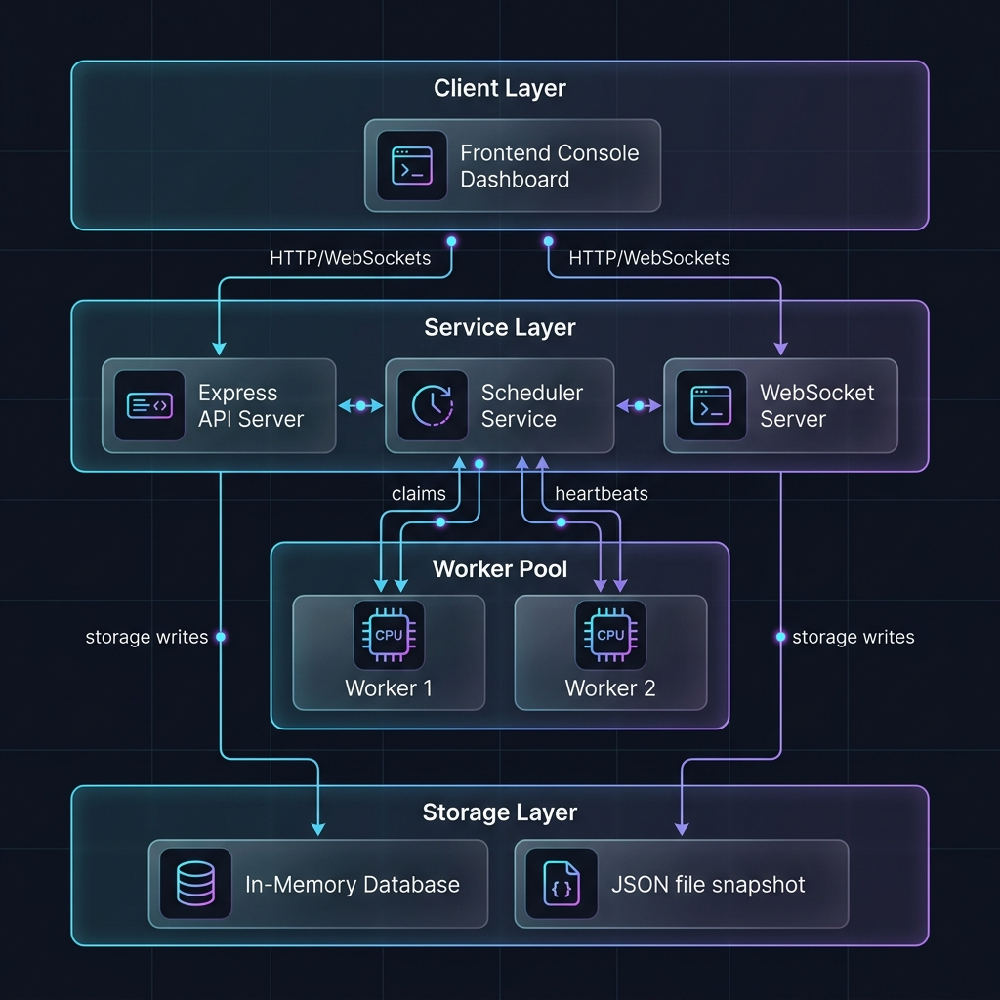
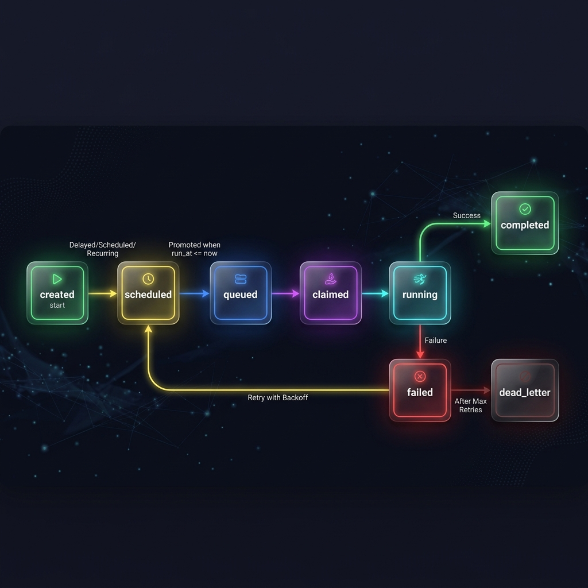

# Distributed Job Scheduler (Distributed Work Engine)

A production-grade, distributed job scheduling and coordination platform built with **Node.js, Express, WebSockets, and Vanilla Javascript**. 

This system represents a decoupled, multi-process architecture engineered to handle complex scheduling paradigms, concurrent execution guarantees, rate limiting, and graceful worker failover.

---

## 🏗️ System Architecture

The platform is divided into decoupled layers designed for horizontal scaling. Multiple worker nodes can execute in parallel, polling and claiming tasks independently.



### Architectural Components
1. **Express API Server** (`backend/src/server.js`): Coordinates incoming requests, manages user authentication, issues JSON Web Tokens (JWT), registers workers, and handles state operations.
2. **Scheduler Service** (`backend/src/services/scheduler.js`): Runs a ticking loop within the API boundary to automatically promote delayed/scheduled jobs and evaluate recurring cron definitions.
3. **Worker Pool** (`backend/src/worker.js`): Standalone Node.js processes. Each worker registers with the coordinator, polls designated queues concurrently, processes payloads, and reports results.
4. **WebSocket Feed Service** (`backend/src/services/ws.js`): Establishes a pub-sub live channel to broadcast execution metrics, worker heartbeats, and lifecycle updates directly to the web dashboard.
5. **Console Dashboard** (`frontend/index.html`): Responsive single-page dashboard rendering throughput telemetry (Chart.js), real-time logs, worker status cards, and interactive dead-letter queue management.

---

## ⚙️ Core Technical Features

### 1. Robust Job State Machine & Lifecycle
Jobs transition through a strictly guarded state machine, providing auditability and fault isolation at every step.



- **Immediate**: Executes as soon as workers become available.
- **Delayed & Scheduled**: Configured with a `run_at` ISO timestamp. Held in `scheduled` status and promoted to `queued` by the scheduler when due.
- **Recurring (Cron)**: Defined using cron expressions. The scheduler expands definitions into discrete job executions automatically.
- **Batch Jobs**: Groups multiple execution entities under a single `batch_id`.
- **Dead Letter Queue (DLQ)**: Isolates permanently failing jobs after exhausting their retry policies, allowing manual review and re-queueing.

### 2. High-Performance Concurrency & Rate Limiting
- **Atomic Job Claims**: Utilizes a single-threaded synchronous claim algorithm (`claimNextJob`) to prevent race conditions or double-processing when multiple workers poll the API simultaneously.
- **Queue Concurrency Restrictions**: Restricts the maximum number of running jobs per queue to respect downstream system capacities.
- **DDoS Protection**: Implements global and authentication-specific rate limits at the HTTP routing boundary via `express-rate-limit`.
- **Per-Queue Throughput Limiting**: Enforces strict rolling 60s windows (`rate_limit_per_min`) to reject job creations with `429 Too Many Requests` when upstream clients exceed queue throughput allowances.

### 3. Fault Tolerance & Resilient Recovery
- **Worker Heartbeat Tracking**: Workers submit status heartbeats every 5 seconds. If a worker goes offline or crashes, its status changes to `offline`.
- **Silent Worker Sweep**: A background sweep thread monitors worker health. When a worker goes silent (heartbeat stale > 15s), the system automatically updates the worker state and reschedules any interrupted in-flight jobs, updating the attempt history.
- **Customizable Retry Policies**: Supports **Fixed Delay**, **Linear Backoff**, and **Exponential Backoff with Jitter** strategies to mitigate transient worker network anomalies.
- **Graceful Shutdown**: The worker captures `SIGINT`/`SIGTERM` to halt polling, register a draining status on the server, allow active jobs to finish processing (up to 30 seconds), and terminate cleanly.

### 4. Enterprise Observability & AI-Powered Diagnostics
- **Detailed Execution Traces**: Every job contains an array of execution attempt logs, tracking duration, worker hostname, outcomes, and error messages.
- **Pulse AI™ Diagnostics**: Dynamically analyzes failed executions and generates root cause analysis along with actionable remediation suggestions directly in the dashboard UI.

---

## 🛠️ Technology Stack & Modularity

- **Backend**: Node.js, Express, WebSocket (`ws`), JWT (`jsonwebtoken`), BCrypt (`bcryptjs`), Cron (`node-cron`).
- **Database Layer**: In-memory relational database (`backend/src/db/store.js`) mirroring the schema, indices, foreign keys, and cascade behaviors of `backend/schema.sql`. surving restarts via filesystem JSON dumps (`backend/data/db.json`).
- **Frontend**: Plain HTML5, Vanilla JavaScript (ES6+), CSS3 with glassmorphism aesthetics, WebSockets client, and Chart.js.

```
backend/
  schema.sql                  # Canonical SQL Schema & Indexing Blueprint
  src/
    db/store.js               # Relational In-Memory persistence engine
    middleware/auth.js        # JWT Authenticator & Role-Based Middleware
    services/
      jobService.js           # Core Business Logic (Create, Claim, Complete, Fail, Sweep)
      scheduler.js            # Delayed job promoter and cron expansion clock
      ws.js                   # WebSocket telemetry broadcaster
    routes/
      auth.js, projects.js    # Routes for authentication, projects, queues,
      queues.js, jobs.js      # jobs, worker registrations, and metrics.
      workers.js, dashboard.js
    server.js                 # Express Application startup
    worker.js                 # Standalone Worker process
    test.js                   # Automated Unit Tests
```

---

## 🚀 Getting Started & Setup

### Prerequisites
- Node.js (v18+)
- npm (v9+)

### Installation
1. Navigate to the backend directory:
   ```bash
   cd backend
   npm install
   ```

2. Start the API Coordinator:
   ```bash
   npm start
   # API: http://localhost:4000
   # WebSocket: ws://localhost:4000/ws
   ```

3. Spin up one or more worker processes (in separate terminal tabs):
   ```bash
   # Provide the queue IDs the worker should process (separated by commas)
   $env:QUEUE_IDS="your-queue-id-1,your-queue-id-2"
   npm run worker
   ```

4. Launch the dashboard:
   Open `frontend/index.html` directly in any web browser.

---

## 🧪 Automated Testing

The system is shipped with a comprehensive unit test suite covering core concurrency mechanics, backoff logic, and the silent worker recovery sweep.

To run the test suite:
```bash
cd backend
npm test
```

### Coverage:
1. **Backoff Math**: Tests fixed, linear, and exponential algorithms, including delay caps.
2. **Priority Ordering**: Asserts that `claimNextJob` claims jobs strictly by priority.
3. **Queue Pausing**: Verifies that paused queues bypass claiming.
4. **Concurrency Guarding**: Confirms that claiming blocks once a queue's limit is reached.
5. **Silent Worker Sweeper**: Asserts that dead workers are swept and their running tasks are rescheduled cleanly.

---

## 📈 Engineering Decisions & Architecture Trade-offs

1. **Relational Emulation**: Because standard sandbox environments cannot build native bindings like SQLite3, a custom relational database layer (`store.js`) was engineered. Swapping this for a SQL client (Knex, Prisma, or pg) is a drop-in change, as the system does not write raw SQL outside `schema.sql`.
2. **Single-Threaded Atomicity**: By operating synchronously, the core claim algorithm prevents concurrent worker checks from interleaving, securing transaction isolation inside the JS event loop.
3. **API-Driven Worker Design**: Workers communicate exclusively over HTTP/JSON rather than sharing memory spaces. This guarantees workers can scale horizontally to separate containers or servers.
